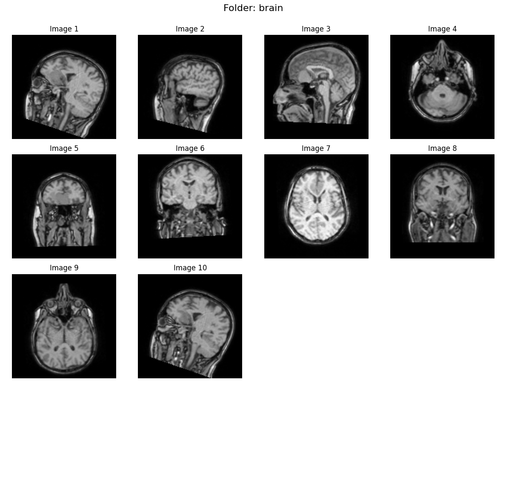
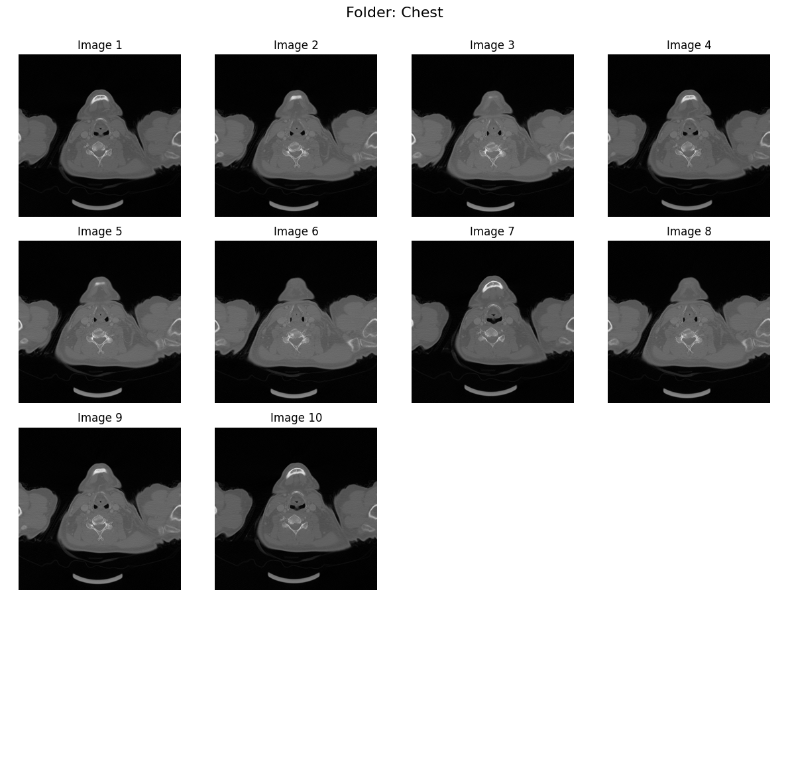
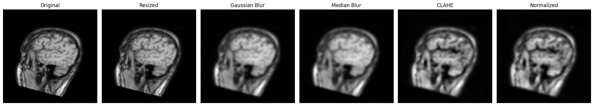
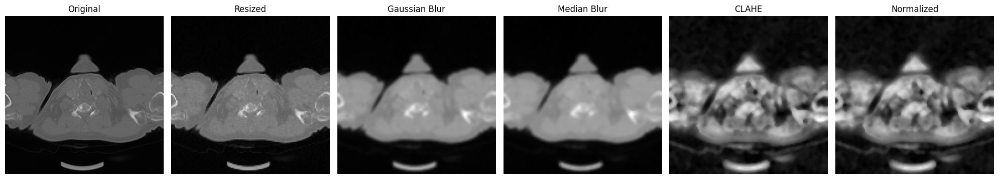
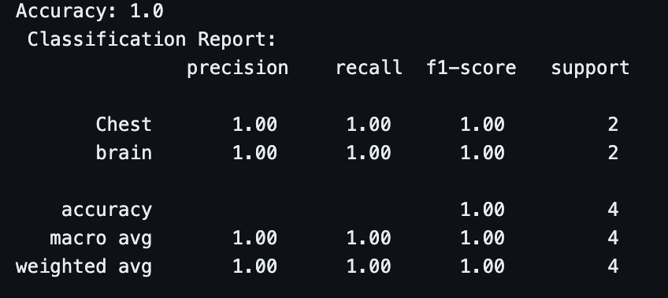

# Classifier: Chest vs Brain DICOM Images

This project is a machine learning-based classifier designed to distinguish between chest and brain medical images in DICOM format. The classifier uses advanced preprocessing techniques, feature extraction methods, and an XGBoost model to achieve an accuracy of 1.

## Dataset

The dataset used for this project is sourced from [The Cancer Imaging Archive (TCIA)](https://www.cancerimagingarchive.net/browse-collections/). TCIA provides a wide range of publicly available medical imaging datasets, including chest and brain scans in DICOM format.

### Dataset Structure

The dataset is organized into the following structure:
```
data/
├── Train/
│   ├── Chest/
│   └── Brain/
├── Test/
│   ├── chest1.dcm
│   ├── chest2.dcm
│   ├── chest3.dcm
│   └── Brain.dcm
```

- **Train**: Contains subfolders `Chest` and `Brain` with DICOM images for training.


- **Test**: Contains individual DICOM files for testing and prediction.

## Features

- **Preprocessing**: Includes resizing, noise reduction (Gaussian and median blur), contrast enhancement (CLAHE), and normalization.
 
 
- **Feature Extraction**: Combines Histogram of Oriented Gradients (HOG) and Gray-Level Co-occurrence Matrix (GLCM) features.
- **Model**: Uses an XGBoost classifier for training and prediction.
- **Streamlit App**: Provides an interactive interface for uploading and classifying DICOM images.

### XGBoost Classifier

The model uses **XGBoost (Extreme Gradient Boosting)**, a powerful and efficient implementation of the gradient boosting algorithm. Below are some key terminologies related to XGBoost:

- **Gradient Boosting**: A machine learning technique that builds an ensemble of weak learners (typically decision trees) in a sequential manner, where each new tree corrects the errors of the previous ones.
- **Boosting**: A method of combining multiple weak models to create a strong predictive model.
- **Decision Trees**: The base learners in XGBoost, which are used to split data into subsets based on feature values.
- **Regularization**: XGBoost includes L1 (Lasso) and L2 (Ridge) regularization to prevent overfitting and improve generalization.
- **Learning Rate**: A parameter that controls the contribution of each tree to the final model. Smaller values make the model learn more slowly but can improve accuracy.
- **Parallel Processing**: XGBoost is optimized for speed and can utilize multiple CPU cores for faster training.
- **Handling Missing Data**: XGBoost can handle missing values in the dataset by automatically learning the best direction to split the data.

XGBoost is widely used in machine learning competitions and real-world applications due to its speed, accuracy, and flexibility.

## Installation

1. Clone the repository:
   ```bash
   git clone https://github.com/your-username/classifier-CvsB.git
   cd classifier-CvsB
   ```

2. Install the required dependencies:
   ```bash
   pip install -r requirements.txt
   ```

## Usage

### Training the Model

To train the model, run the following command:
```bash
python train.py
```
This will preprocess the training data, extract features, and train the XGBoost model. The trained model will be saved in the `model/` directory.


### Predicting Classes

You can predict the class of a DICOM file using the command-line tool:
```bash
python predict.py /path/to/dicom/file.dcm
```

Alternatively, use the Streamlit app for an interactive experience:
```bash
streamlit run app.py
```
- Select a file from the `data/Test` folder or upload a new DICOM file.
- The app will display the image and predict its class (Chest or Brain).

## Project Structure

```
classifier-CvsB/
├── app.py                # Streamlit app for interactive predictions
├── train.py              # Script to train the model
├── predict.py            # Command-line tool for predictions
├── model/
│   └── model.py          # Model training and prediction logic
├── utlils/
│   ├── dataloader.py     # DICOM data loading and preprocessing
│   ├── preprocess.py     # Image preprocessing functions
│   └── featureextracter.py # Feature extraction methods
├── requirements.txt      # Python dependencies
├── README.md             # Project documentation
└── data/                 # Dataset folder (not included in the repository)
```

## Acknowledgments

- **Dataset**: [The Cancer Imaging Archive (TCIA)](https://www.cancerimagingarchive.net/browse-collections/)
- **Libraries**: This project uses libraries such as `pydicom`, `OpenCV`, `scikit-learn`, `xgboost`, and `Streamlit`.

## License

This project is licensed under the MIT License. See the LICENSE file for details.